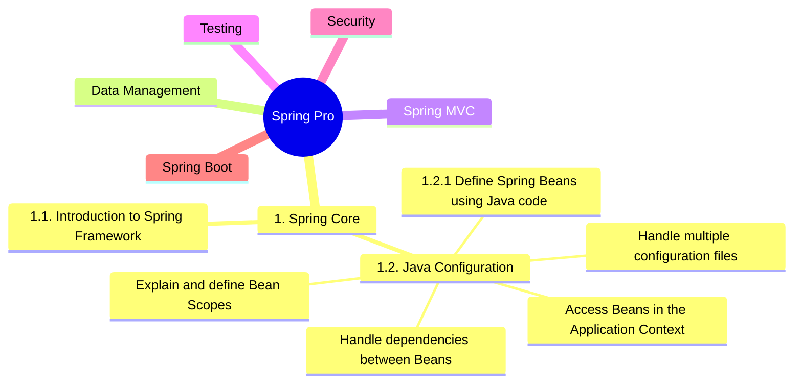

# Spring
*Spring Training*

 
 

 
 

## Content

* Spring Certified Professional:
    * [1. Spring Core](../01-spring-core)
        * [1.1. Introduction to Spring Framework]()
        * [1.2. Java Configuration]()
            * [1.2.1. Define Spring Beans using Java code]()
    * [2. Data Management](../02-data-management)
* Spring Udemy :
    * [Section 02: Building a Spring Boot Web App](./content/02-build-spring-boot-app)
    * [Section 03: Dependency Injection with Spring](./content/03-dependency-injection)
    * [Section 04: Building a Jokes App](./content/04-build-jokes-app)
    * [Section 05: Spring Configuration](./content/05-spring-configuration)
    * [Section 06: Externalising Properties](./content/06-externalising-properties)
    * [Section 07: Spring MVC Web Development](./content/07-spring-mvc-web-dev)
    * [Section 08: JPA Data Modelling](./content/08-jpa-data-modelling)
    * [Section 09: Project Lombok](./content/09-project-lombok)
    * [Section 10: Testing Spring Applications](./content/10-testing-spring-apps)
    * [Section 11: CRUD Operations with Spring MVC](./content/11-spring-mvc-crud-ops)
    * [Section 12: Validation & Constraints with Spring MVC](./content/12-spring-mvc-validation)
    * [Section 13: Introduction to Docker](./content/13-docker-intro)
    * [Section 14: Working with Containers & Images](./content/14-working-with-containers)
    * [Section 15: Running Spring Boot in a Centos Image](./content/15-spring-boot-with-centos)
    * [Section 16: Introduction & Installation of MySQL](./content/16-mysql-introduction)
    * [Section 17: Connecting to MySQL](./content/17-mysql-connection)
    * [Section 18: Using MySQL with Spring Boot](./content/18-mysql-with-spring-boot)
    * [Section 19: Spring Data MongoDB](./content/19-spring-data-mongodb)
    * [Section 20: Introduction to Reactive Programming](./content/20-reactive-prog-intro)
    * [Section 21: Rx with Spring & Mongo](./content/21-rx-spring-mongo)
    * [Section 22: Introduction to Spring WebFlux](./content/22-spring-webflux)
    * [Section 23: Introduction to RESTful Web Services](./content/23-restful-web-services)
    * [Section 24: RESTful Web Services with Spring MVC](./content/24-restful-with-spring-mvc)
    * [Section 25: Using Swagger with Spring Boot](./content/25-swagger-with-spring-boot)
    * [Section 26: RESTful Web Services with Spring WebFlux](./content/26-restful-spring-webflux)
    * [Section 27: Spring MVC Content Negotiation](./content/27-content-negotiation)
    * [Section 28: Spring REST Docs](./content/28-spring-rest-docs)
    * [Section 29: JMS Messaging](./content/29-jms-messaging)
    * [Section 30: Troubleshooting Spring](./content/30-troubleshooting)

    <!-- Sections 31+ ommitted for irrelevance -->

 

## Projects
* [Pet Clinic](./content/projects/pet-clinic)

 

## Notes
* Spring Certification: 
    * [VMware Spring Certified Professional](https://www.vmware.com/learning/certification/spring-certified-pro.html)
* Spring Guru Udemy Course: 
    * [Spring Framework 5 - Beginner to Guru](https://www.udemy.com/course/spring-framework-5-beginner-to-guru/)
* Postman:
    * [Spring.postman_collection.json](./resources/postman/Spring.postman_collection.json)
* Useful Commands:
    * [docker-c.md](./content/misc/docker-c.md)
    * [sql-c.md](./content/misc/sql-c.md)