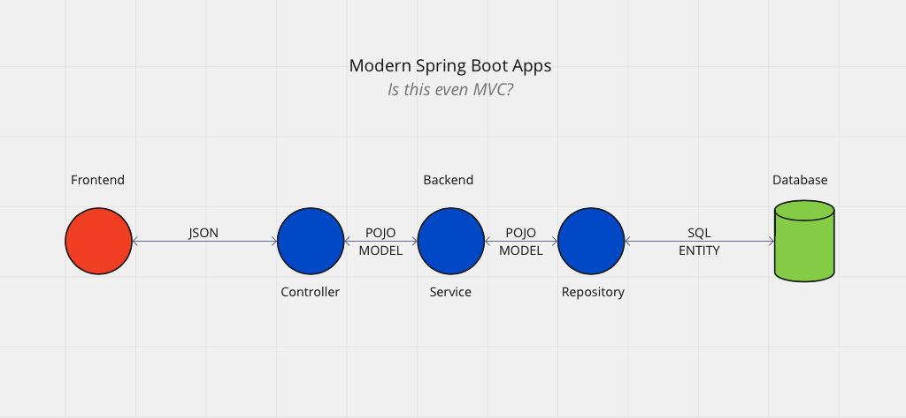
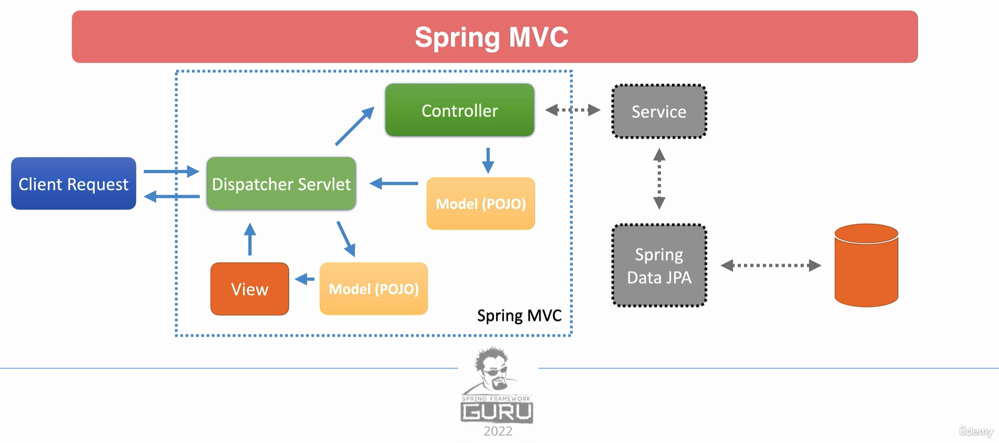

# Building a Spring Boot App
*High-level introduction to Spring Boot applications*

 

## Exercises
* [Introductory Webapp](./exercises/introduction)

 

## Spring Initialzr
* Useful Links:
    * https://start.spring.io/
    * https://github.com/spring-io/start.spring.io
* Overview:
    * Spring Initializr offers us an simple UI-driven tool for creating Spring applications
        * It allows us to achieve in the order of minutes, what used to take half a day to set up
* Note:
    * IntelliJ UE allows us to create Spring Boot projects (via the Spring Initializr API), through the 'new project' wizard

 

## Project Management
* In the 'Introductory' exercise, we're using maven.
    * In the associated `pom.xml` we configure the project meta-data and specify the required dependencies
    * A best-practise convention is to ommit the version numbers for dependencies, where possible:
        * Instead, relying on the dependency versions that come from the `spring-boot-starter-parent` POM, as they are managed by the Spring team ('curated-dependencies')

 

## JPA Entities
* POJO: Plain-Old Java Object
    * There seems to be a non-trivial [discussion](https://stackoverflow.com/questions/3326319/what-is-meaning-of-plain-old-java-object-pojo) of what constitutes a POJO
    * I use the term in reference to a Java class that is not bound to a specific framework and is typically a class with fields, a constructor and getters/setters only
        * To be precise, this is perhaps too strict a definition because it can probably also contain business logic within extra methods. 
        * However, I find myself using the term in reference to Java objects that serve as JPA entities, hence my tighter definition 
* `@Entity` is used to convert our POJO into a JPA entity
    * For our JPA entity, we need to specify an ID and a generation strategy for that ID
        * We apply the following annotations to the desired field:
            * `@Id`
            * `@GeneratedValue(strategy = GenerationType.AUTO)`
    * We can set the relationships between our JPA entitites by using annotations such as `@ManyToMany`
        * Likewsie, we may wish to define a join table and can do so by using `@JoinTable`
        * We can see an example of this relationship between the `Author` and `Book` entities with the [Introductory Webapp](./exercises/introduction/src/main/java/com/jrsmiffy/springguru/introduction/model/Book.java)
    * JPA requires our entities to have a no-args contructor
* Equality in Hibernate:
    * We *can* provide a custom implementation of an entity's `hashCode()` and `equals()` methods in order to define what it means for our objects to be equal
    * This is a contentious topic, with the most popular approach being found in this [article](https://web.archive.org/web/20171211235806/http://www.onjava.com/pub/a/onjava/2006/09/13/dont-let-hibernate-steal-your-identity.html) and Stack Overflow [post](https://stackoverflow.com/questions/5031614/the-jpa-hashcode-equals-dilemma)
        * In summary:
            * "Object identity is deceptively hard to implement correctly when objects are persisted to a database. However, the problems stem entirely from allowing objects to exist without an id before they are saved. We can solve these problems by taking the responsibility of assigning object IDs away from object-relational mapping frameworks such as Hibernate. **Instead, object IDs can be assigned as soon as the object is instantiated.** This makes object identity simple and error-free and reduces the amount of code needed in the domain model."
        * TLDR: GRoT - don't bother overriding the equality
    * If you ever did want to override the `hashcode()`/`toString()`/`equals()` methods, an example can be found in the `Book` [class](./exercises/introduction/src/main/java/com/jrsmiffy/springguru/introduction/model/Book.java)

 

## H2
* Console:
    * We can access the H2 console by setting the following property in our `application.properties` and going to `http://localhost:8080/h2-console`
        * `spring.h2.console.enabled=true`
    * If we do not set a JDBC url in the config, we can find the temporary JDBC url in the tomcat startup logs 
        * `H2 console available at '/h2-console'. Database available at 'jdbc:h2:mem:909af60b-c298-4c9c-a9dd-85f3e7e44aa8'`
            * We use `jdbc:h2:mem:909af60b-c298-4c9c-a9dd-85f3e7e44aa8` as the JDBC url, with a user:pass combo of `sa`:none

 

## Spring MVC
* MVC Pattern:
    * 'Model-View-Controller' is an architectural pattern for building applications that accept a request, process it and serve a response back to the user
    * Note, the order of the MVC name (Model, then View, then Controller):
        * I see this as moving back from the database to the user, from the user to the databse would be CVM (Controller, then View, then Model).
        * First, the request hits the controller, which creates the view to be returned by manipulating the model. The view, in this sense, is not the UI but rather the response containing the manipulated model.

     
     

    

     
     

    * Components:
        * Model: 
            * Simple POJO with collection of properties used by the view; it is not the data itself, rather the wrapper in which in the data gets pass around within the app
        * View: 
            * The data requested by the client, which is rendered to the screen in the UI but is not the UI itself; the view contains the manipulated model data
        * Controller: 
            * Handles the request and returns the response (the view)
                * The controller is the interface between the user and the application and as such should contain no/minimal business logic for manipulating the model (creating the view) - this should be delegated to a service layer
    * Advantages:
        * The MVC pattern allow us to segregate the business logic (service layer), data (database) and the UI (frontend + view) so each responsibility can be implemented independently and changes to one, do not effect the others
            * In this sense, the controller layer, repository layer and model are just nuts and bolts the allow data to flow through the app, with:
                * The controller layer being an interface between the frontend and backend
                * The repository layer being an interface between the backend and the database
                * The model being a wrapper that allows data to be passed between components of the application
    * How does MVC fit into the structure of modern Spring Boot apps?

     
     

    

     
     

* Spring MVC
    * Spring MVC is a Spring module that combines the advantages of the MVC pattern with the convenience of Spring.

     
     

    

     
     

    * Overview:
        * When a request comes in, Spring registers a Dispatcher Servlet within the Tomcat Server that the application is running on
        * The Dispatch Servlet is akin to a Main Controller that routes requests to the desired endpoint in our custom controller layer
        * Our controller layer invokes the desired business logic in the service layer, which in turn manipulates the data model that has been retrieved using the Spring Data JPA module
        * The service hands the manipulated model back to the controller, which passes it to the Dispatcher Servlet
        * The Dispatcher Servlet creates the view from the manipulated model and renders it for the user via the selected template engine (JSP, Thymeleaf, etc)
