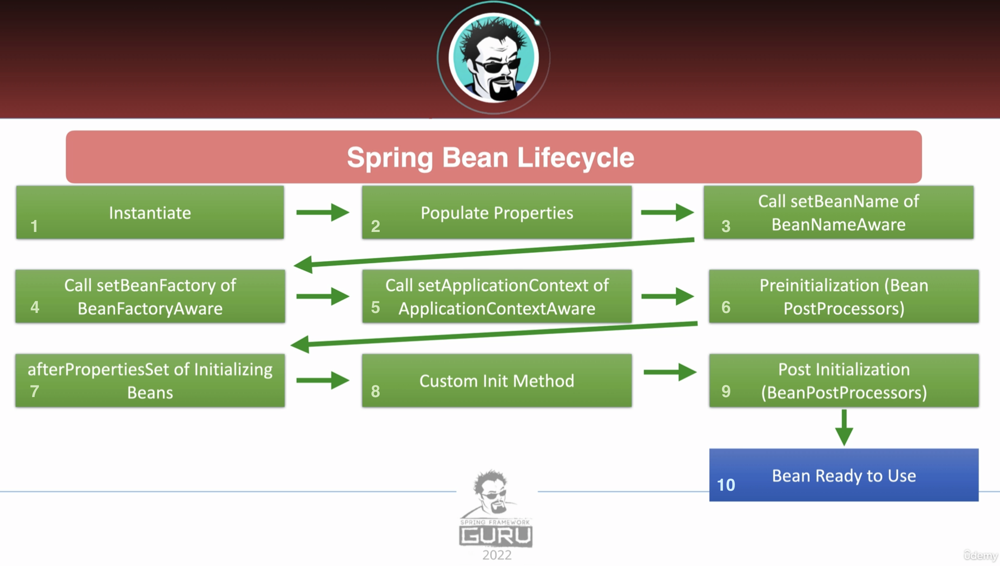

# Section 3: Dependency Injection with Spring
*Allowing the framework to create and manage dependencies for us*

<br>

## Exercises
* [Dependency Injection](./exercises/dependency-injection)

<br>

## The SOLID Principles of OOP
* Dr Bob's five principles of effective object-oriented design:

#### Single Responsibility
* Each class should have exactly one responsiblility
* This is broken if a class has more than one reason to change
* In general, classes should be small; large classes should be split into smaller ones
* Note, the class-level has been used to illustrate the point here but the same applies from the field and method levels all the way up to the level of micro-services

#### Open Closed
* Classes should be open for extension but closed to modification
* This means that you can extend the functionality of a class, without modifying the exisiting functionality
* Use abstract base classes, where appropriate
* Use encapsulation - adding public getters and setters, where appropriate

#### Liskov Substitution
* Liskov Substitution states that: 
    * If `B` is a child of `A`, we should be able to replace `A` with `B`, without disrupting the behaviour of the program.
* In other words, you should be able to substitute a parent class with its child.

#### Interface Segregation
* Make fine-grained interfaces that are client-specific
* Many client-specific interfaces are better than one general-purpose interface
* Keep components focused on a single responsibility and minimise dependence between them

#### Dependency Inversion
* Abstractions should not depend on details; Details (concrete implementations) should depend on abstractions
* High-level modules should not import anything from low-level modules. Both should depend on abstractions (e.g., interfaces)
* Note, this is not the same Dependency Injection; which is how objects obtain their dependencies at runtime

<br>

* Summary:
    * A key theme of SOLID is to avoid the tight-coupling of software components
        * This makes code more maintainable, easier to test and easier to extend over time
    * Software development is about trade-offs:
        * We should be pragmatic when using SOLID, rather dogmatic

<br>

## The Spring Application Context
* The Spring Application Context is an object that provides configuration information for the rest of the app.
    * It represents the Spring IoC container and is responsible for instantiating, configuring and assembling the beans.
    * The responsibilites of the `ApplicationContext` interface include, but are not limited to:
        * Bean Factory for application components
        * Bean injection
        * Application listeners
        * Logger
        * Loading config files (`.properties`, `.yaml`, etc)
    * Good References:
        * [Stack Overflow post](https://stackoverflow.com/questions/19615972/application-context-what-is-this)
        * [Zetcode article](https://zetcode.com/springboot/applicationcontext/)
        * [Spring docs](https://docs.spring.io/spring-framework/docs/current/javadoc-api/org/springframework/context/ApplicationContext.html)
* The hallmark of dependency injection is allowing the Spring framework to create and manage our dependencies for us
    * We can see in the [example](./exercises/dependency-injection/src/main/java/com/jrsmiffy/springguru/dependencyinjection/DependencyInjectionApplication.java), that the `@Controller` annotation, automatically loads our class into the application context.
        * Note, `SpringApplication.run()` in the app's `main()` method returns an instance of `ApplicationContext`

<br>

## Dependency Injection
* In our code, we create a class by specifying the composite classes (dependencies) that are required for it's function
    * At runtime, Spring provides these dependencies without us having to be concerned about the process
        * They are just made available to us, auto-magically.
        * The class bears no responsibility about how its dependencies are instantiated
* Constructor vs Field Injection:
    * Spring prefers constructor injection:
        * It is better, more often than not, to list your dependency fields as constructor parameters; rather than declare them with `@Autowired` at the field-level.
        * Rationale:
            * Dependencies are clearly identifiable
            * Dependencies can be `final`
            * Dependencies can be mocked in testing
                * Without tricks like reflection
        * Constructor injection with interfaces is preferred over concrete classes:
            * It enables the exact implementation to be decided at runtime
            * It makes mocking even easier
            * It follows the Integration Segregation SOLID principle
        * Good reference:
            * [Stack Overflow post](https://stackoverflow.com/questions/40620000/spring-autowire-on-properties-vs-constructor)
* Note, you don't have to defer to the Spring Context to manage every object
    * You should be pragmatic in the use of constructor injection, field injection (`@Autowired`) and plain old instantiation with `new`
        * Each one has its place
* Inversion of Control (IoC):
    * This is the technique that allows dependencies to be injected at runtime
        * Where the control for which implementation is injected is deletegated to the framework, rather than the class receiving them
        * Good reference:
            * [Stack Overflow post](https://stackoverflow.com/questions/3058/what-is-inversion-of-control)
    * IoC vs DI:
        * DI refers to the composition of your class; in the sense that we define objects without creating them
        * IoC is part of the runtime environment for our application
            * Which is responsible for performing the actual dependency injection
                * Here, that control is inverted and delegated from the class to the framework
* `@Autowired`:
    * All Spring Beans are managed by the framework; that is, they live inside a container, called the Application Context
        * Autowiring is the process by which an instance of one bean is injected into the desired field of another bean
            * Therefore, the `@Autowired` annotation marks that desired field for dependency injection at runtime
                * [Good Stack Overflow](https://stackoverflow.com/questions/3153546/how-does-autowiring-work-in-spring)
    * Note:
        * Only other managed beans can be injected with `@Autowired`
            * Typical err: `Could not autowire. No beans of 'GreetingService' type found`
                * We need to ensure `GreetingService` is annotated with `@Service`
                * With examples like `RestTemplate`, we need to manually create the instance:
                    ```java
                        @Bean
                        public RestTemplate restTemplate(RestTemplateBuilder builder) {
                            return builder.build();
                        }
                    ```
                    * [Good Stack Overflow](https://stackoverflow.com/questions/28024942/how-to-autowire-resttemplate-using-annotations)
        * `@Autowired` can be applied to the constructor (required before Spring 4.2), the setter or the field directly
            * I see no reason to ever apply it to the constructor or setter; use it on the field only
        * Reminder: constructor-injection is recommended in Spring
            * IntelliJ will raise a warning saying as much, on `@Autowired` fields
        * `@Inject` is similar annotation for dependency injection
            * However, it comes from Java's core technology and is separate from Spring
            *  [Good Stack Overflow](https://stackoverflow.com/questions/7142622/what-is-the-difference-between-inject-and-autowired-in-spring-framework-which)        
* Spring Beans:
    * Objects that are managed by the Spring IoC Container are called "beans"
        * A Bean is an object that is instantiated, assembled and managed by the Spring IoC Container
    * [Good Stack Overflow](https://stackoverflow.com/questions/17193365/what-in-the-world-are-spring-beans)
* Qualifiers:
    * The `@Qualifier` annotation allows us to specify which bean we wish to inject, by providing its name
        * This avoids a `NoUniqueBeanDefinitionException` because it disambiguates the selection, if more than one bean of the same type exists
            * One [example use](./exercises/dependency-injection/src/main/java/com/jrsmiffy/springguru/dependencyinjection/controller/ConstructorInjectedController.java) would be to differentiate which service we want injected into our controller, should there be multiple implementations
        * [Baeldung Reference](https://www.baeldung.com/spring-qualifier-annotation)
    * Similarly, the `@Primary` annotation tells Spring which bean to prioritise for injection, when we have multiple beans of the same type
        * It contrasts from `@Qualifier` in that `@Primary` is applied to the dependency, whereas `@Qualifier` is applied in the dependent class.

<br>

## Spring Profiles
* Profiles are a commonly-used feature of dependency injection within the Spring framework
    * They allow us to have beans in our configuration that will take on different characteristics at runtime
* If a bean has an inactive profile applied to it, that bean will not be loaded into the Spring Context
    * In other words, a bean with an attached profile will only be available for dependency injection, if that profile is active at runtime
* Default profile:
    * There exists a `default` profile that is always considered active, even if another profile has also been set
        * Any bean that does not specify a profile belongs to the default profile
    * Spring also provides a way to set the default profile when no other profile is active, via the application config:
        * `spring.profiles.default=<PROFILE_NAME>`
        * Note, this doesn't replace the `default` profile, as the `application.properties` is still applied and all non-profiled beans are still wired
            * In a sense, this becomes the 'default active' profile
* Active profile:
    * We can set the active profile in two ways:
        * In the application config: `spring.profiles.active=<PROFILE_NAME>`
        * As a command-line parameter: `-Dspring.profiles.active=PROFILE_NAME>`
    * When a non-default profile is active, configuration from the `application-<PROFILE_NAME>.properties` file will be applied
        * By the same token, the default profile is always active and so the 'default' `application.properties` file is always applied
            * Therefore, we do not have to repeat properties in our non-default profiles
                * We can avoid duplication by putting all generalised config into the default `application.properties`
            * Note, `application-default.yml` is functionally equivalent to `application.properties`

<br>

## Spring Bean Lifecycle
* Startup Steps:
    1. Instantiate the class
    2. Set up the properties of the class
    3. Spring will call the `setBeanName()` method, if you've implemented `BeanNameAware`
    4. Spring will call the `setBeanFactory()`, if you've implemented `BeanFactoryAware`
    5. Spring will call `setApplicationContext()`, if you've implemented `ApplicationContextAware`
    6. Pre-Initialisation stage (using Bean Post-Processors)
    7. Spring will call the `afterPropertiesSet()` method of the `InitializingBean` interface
    8. Custom init methods will be run
    9. Post-Initialisation stage (using Bean Post-Processors)
    10. The bean is now ready for use; the application is ready when all beans are wired into the context

<br>



<br>

* Shutdown steps:
    1. Container shutdown is initiated
    2. Methods annotated with `@PreDestroy` are executed
    3. Spring will call the `destroy()` method, if `DisposableBean` is implemented

<br>


<br>

* Callback Interfaces:
    * You can implement the following interfaces for call back events:
        * `InitializingBean.afterPropertiesSet()`:
            * Called after the properties are set during start up
        * `DisposableBean.destroy()`:
            * Called as part of bean destruction during shutdown
* Lifecycle Annotations:
    * Spring provides two annotations that allow us to hook into the bean lifecyle:
        * `@PostConstruct`:
            * Annotated methods will be called after the bean is constructed but before it is returned to the requesting object
        * `@PreDestroy`:
            * Annotated methods will be called just before the bean is destroyed by the container
* Bean Post-Processors:
    * Provides a way to tap into the Spring context lifecycle and interact with beans as they are processed
        * These are called for all beans in the context
    * The `BeanPostProcessor` interface offers us two methods:
        * `postProcessBeforeInitalization()`:
            * Called before the bean initialization method
        * `postProcessAfterInitialization()`:
            * Called after bean initialization
* `Aware` Interfaces:
    * There exists 14+ `Aware` interfaces, that are used to access the Spring Framework infrastructure
        * They are used frequently by the Spring Framework, itself
            * However, are rarely used by us, the developers
    * Examples include: `ApplicationContextAware`, `BeanNameAware` & `MessageSourceAware`
* Good [article](https://dzone.com/articles/spring-bean-lifecycle) on the Spring Bean Lifecycle