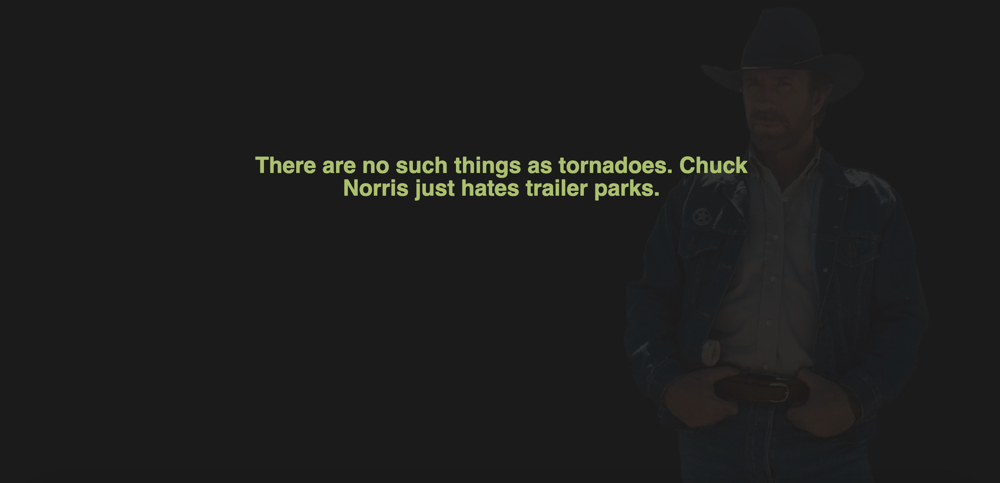

# Section 4: Build a Spring Boot Jokes App
*Using the knowledge built so far to create a spring boot app that tells jokes*

 

## Exercises
* [Jokes](./exercises/jokes)

 

## Assignment
* Build a Spring MVC app that uses Spring Guru's 'Chuck Norris Joke' generator
    * Instructions [here](./res/AssnBuildSBJokesApp.pdf)
* Extra:
    * Build out the functionality using TDD (with Spock)

 
 

