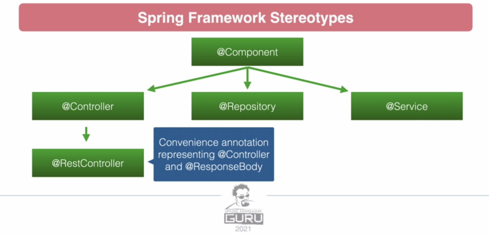

# Section 5: Spring Configuration
*Defining Spring Beans and modifying their behaviour*

 

## Exercises
* [Dependency Injection [Section 3]](../03-dependency-injection/exercises/dependency-injection) 

 

## Spring Configuration Options
* XML-based Configuration:
    * Introduced in Spring 2
    * Still commonly used in legacy apps
        * However, now the industry has moved on to Java/Annotation-based configurations 
            * These are more readable and flexible
* Annotation-based Configuration:
    * Introduced in Spring 3 (after annotations were added with Java 5)
    * Spring Beans are found via 'Component Scans'
        * Component Scans locate Beans via class-level annotations:
            * Such as: `@Component`, `@Controller`, `@Service`, `Repository`
* Java-based Configuration:
    * Introduced in Spring 3
    * Java classes are used to define Beans
        * Such 'configuration' classes are annotated with `@Configuration`
        * Methods are used to return Spring Beans and are marked with `@Bean`
* Groovy-based Configuration:
    * Introduced in Spring 4
    * Beans can be defined via a Groovy DSL
        * Borrowed from Grails; which is a framework built on top of Spring (using Groovy)

 

## Spring Stereotypes
* Spring Stereotypes are class-level annotations that define Spring Beans
    * When annotated classes are detected via the Component Scan, an instance of the class is added to the Spring Context
* The available Stereotypes are:
    * `@Component`
    * `@Controller`
    * `@RestController`
    * `@Repository`
    * `@Service`

* The `@Controller`, `@Repository` and `@Service` annotations inherit from `@Component`
    * Functionally, there is no difference between them
* `@RestController` adds `@ResponseBody` to methods in your controller, ensuring they return JSON by default

 

## Component Scans
* `@ComponentScan` searches for class-level stereotype annotations; these identify beans to be loaded into the Spring Context
* `@SpringBootApplication` defines an automatic component scan on the package where the annotation is used, plus all of its sub-packages
    * If you want to scan a package outside of the base package, you need to to specify it using `@ComponentScan(basePackages={})`
        * Good [article](https://www.springboottutorial.com/spring-boot-and-component-scan)
* On very large applications, with 100's of components, there is a noticeable performance impact caused by the Component Scan
    * This is because the Component Scan uses Java's `ReflectionUtils` to look inside the class, which is considered a slow process
        * Whilst this is a trivial issue on standard applications, we can use Java-based configurations to avoid relying on the component scan
* Component Scan [demo](../03-dependency-injection/exercises/dependency-injection/src/main/java/com/jrsmiffy/springguru/dependencyinjection/DependencyInjectionApplication.java)

 

## Java-based Configuration
* To define a Bean via Java-based Configuration is to create a configuration class
    * Plus, a method that returns an instance of the class to be loaded into the Spring Context
        * We signal the presence of a Bean to Spring via the class-level annotation `@Configuration` and the method-level annotation `@Bean`
* From the Spring [docs](https://docs.spring.io/spring-framework/docs/current/javadoc-api/org/springframework/context/annotation/Configuration.html):
    * `@Configuration` indicates that a class declares one or more `@Bean` methods and may be processed by the Spring container to generate bean definitions and service requests for those beans at runtime
* Typically, we would define a Bean using Java-based Configuration if it was a 3rd party component
    * GRoT:
        * If you own the code, define the Bean using the Stereotype annotation
        * If you do not own the code, define the Bean with Java-based Configuration (`@Configuration` + `@Bean`)
* We can apply the `@Primary` and `@Profile` annotations to our Java-based Configuration beans
    * When using the Spring Stereotype annotations (like `@Service`), `@Primary`/`@Profile` are applied at the class-level
        * In our `@Configuration`-marked class, we apply `@Primary`/`@Profile` at the method level - alongside `@Bean`
* We can inject dependencies into our Java-defined beans by having the `@Bean`-annotated method accept an argument of the dependency type
    * Reminder: it is best practise to code to an interface where possible, when using dependency injection
* Java-based Configuration [example](../03-dependency-injection/exercises/dependency-injection/src/main/java/com/jrsmiffy/springguru/dependencyinjection/config/GreetingServiceConfig.java)

 

## XML Configuration
* We can define Spring Beans via a `<PROJECT>-config.xml` file in `/resources`
    * In this file, all we need to specify is the `name` for the bean and point to the `class` that it represents
* `@ImportResources` is applied to a class marked with `@Configuration` to include the XML config file in the Component Scan
    * Note: `@ImportResources` can also be applied to the main application class (marked with `@SpringBootApplication`)
        * Reminder: `@SpringBootApplication` is equivalent to `@Configuration` + `@ComponentScan` + `@EnableAutoConfiguration`
* XML Configuration [example](../03-dependency-injection/exercises/dependency-injection/src/main/resources/dependencyinjection-config.xml)

 

## Bean Scopes
* The 'Scope' of a Spring Bean refers to its lifespan and potential number of instances
* Bean Scopes:
    * Singleton:
        * The default scope
        * Only a single instance of the bean will exist in the IoC Container
        * Every object that requests the bean will share that single instance
    * Prototype:
        * Contrasts Singleton, as multiple instances of the bean can exist in the IoC Container
        * Each time the bean is requested, a new instance is created and so they are not shared
    *  Only valid in a web-aware Spring Application Context:
        * Request:
            * A single instance exists per HTTP request
        * Session:
            * A single instance exists per HTTP session
        * Global-Session:
            * A single instance per global HTTP session
        * Application:
            * A bean is scoped to the lifecycle of a ServletContext
        * Websocket:
            * A bean is scoped to the lifecycle of a WebSocket
    * Note:
        * There also exists a 'Custom' scope that allows you to extend the web-aware Scopes
            * Singleton and Prototype cannot be modified with the Custom Scope
* Generally speaking, Spring Beans should be immutable and stateless
    * As a result, we can rely on Singleton for the majority of cases
* Bean Scope [example](../03-dependency-injection/exercises/dependency-injection/src/main/java/com/jrsmiffy/springguru/dependencyinjection/config/PrototypeBean.java)
