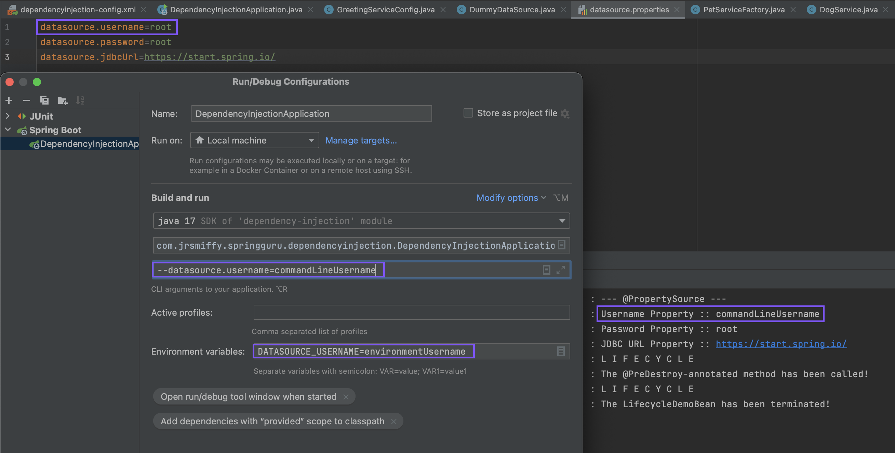

# Section 6: Externalising Properties
*Externalising properties to enable behavioural change in different environments*

<br>

## Exercises
* [Dependency Injection [Section 3]](../03-dependency-injection/exercises/dependency-injection) 

<br>

## Overview
* It is best practise to store configuration data in the environment so we can change an application's behaviour without a rebuild
    * This allows a single immutable artefact to move through each environment on its way to production
    * We should avoid hard-coding any value that is subject to change
* Externalising configuration is also a good idea for security reasons:
    * We can avoid checking in credentials into our code repository if they exist outside of the codebase
* Candidate properties:
    * User credentials
    * API keys
    * URLs
    * Paths
    * Queue names
* Externalisation Methods:
    * Property files (`.properties`, `.yaml`)
    * Command-line arguments
    * `SPRING_APPLICATION_JSON`
    * JNDI
    * OS Environment variables
* Property Hierachy:
    * There exists a hierachy of externalisation options such that properties will be overwritten depending on the precedence of the method with which they are defined
        1. (lowest priority) Properties define in the JAR/WAR `.properties`/`.yaml` files
        2. External property files on the file system
        3. Profile specific properties files (in JAR, then external)
        4. OS Environment variables
        5. Java system properties
        6. JNDI
        7. `SPRING_APPLICATION_JSON`
        8. Command-line arguments
        9. (highest priority) Test properties (for test setup)
* Pragmatic Guide to Hierachy:
    * Use the default profile `.properties`/`.yaml` files, where possible
    * Use profile specific `.properties`/`.yaml` files, for profile specific config only
    * Use environment variables (either at the platform [k8s] or OS levels, etc) for sensitive config, like passwords
* Spring Cloud Config:
    * Is a further option for cloud environments, where Spring applications obtain config from a configuration server
        * Out of scope for this course

<br>

## @PropertySource
* The `@PropertySource` annotation allows us to specify a source of properties in an external file and load them into the Spring Context
    * It is applied at the class-level, to classes marked with `@Configuration`
        * Example: `@PropertySource("classpath:datasource.properties")`
* The `@Value` annotation is used to reference individual properties with Spring Expression Language, SpEL (`${}`)
* `@PropertySource` [example](../03-dependency-injection/exercises/dependency-injection/src/main/java/com/jrsmiffy/springguru/dependencyinjection/config/GreetingServiceConfig.java)

<br>

## Environment Variables & Command-line Arguments
* IntelliJ:
    * We can set both environment variables and command-line arguments in the run configuration:



<br>

* From the Terminal:
    * On MacOS, to set OS-level environment variables:
        * Add `export VAR_NAME=value` to your `bash_profile` (bash) or `zshrc` (zsh)
    * We can set command-line arguments using `-Dspring-boot.run.arguments` (Maven) or `--args=` (Gradle)
        * Maven example: `mvn spring-boot:run -Dspring-boot.run.arguments=--person.name=Test`
            * Reference using `${person.name}` in Spring
        * Gradle example:
            * `build.gradle`:
                ```groovy
                    bootRun {
                        if (project.hasProperty('args')) {
                            args project.args.split(',')
                        }
                    }
                ```
            * `./gradlew bootRun --args=--customArgument=custom`
* Reminder:
    * Command-line arguments take precedence over OS-level environment variables

<br>

## Application Properties
* With Spring alone, we need to define a custom `.properties` file and load it into the context with `@PropertySource`
    * Spring Boot offers us `application.properties`, which is automatically loaded into the context
        * Reminder: Spring Boot is a wrapper that configures Spring with an opinionated set-up
* Profile-specific application properties:
    * We can define profile-specific properties files by appending the profile name to `application.properties`
        * Convention: `application-<PROFILE_NAME>.properties`
    * When the profile is set at runtime, the profile-specific properties file will be loaded into the context
        * This happens alongside the 'default' `application.properties` 
            * Where property conflicts occur, precedence is given to profile-specifc properties file
* Spring also allows application properties to be defined using YAML syntax (`application.yaml`)
    * YAML:
        * Purpose: it is a human-readable data serialization language that used to express key-value pairs of information
        * Meaning: YAML ain’t markup language (a recursive acronym), which emphasizes that YAML is for data, not documents. 
        * Extension: both `.yaml` or `.yml` are accepted but the former is recommended
    * Note, we should refrain from mixing both `application.properties` and `application.yaml` files in the same application
        * I would default to using `.yaml`, as there is less noise than with `.properties`
    * `application.yaml` [example](../03-dependency-injection/exercises/dependency-injection/src/main/resources/application-local.yaml)