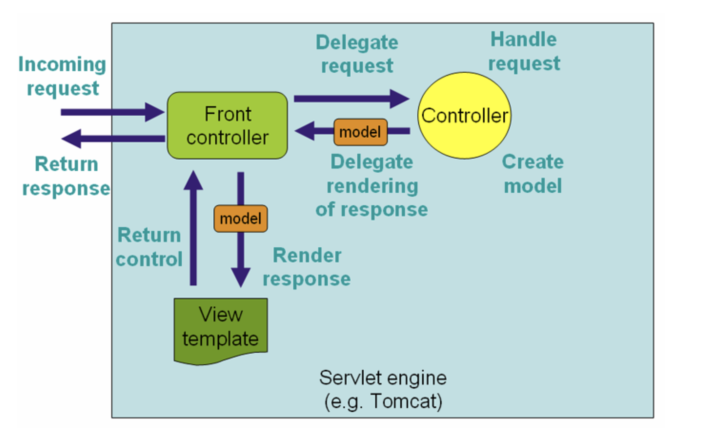
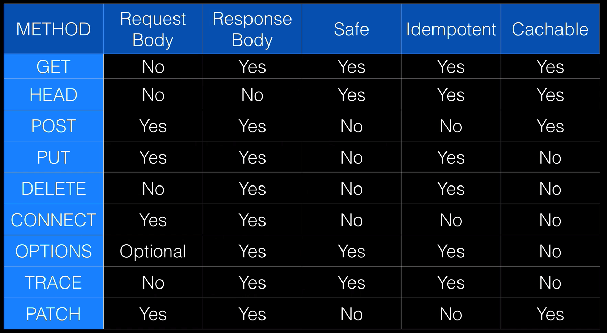
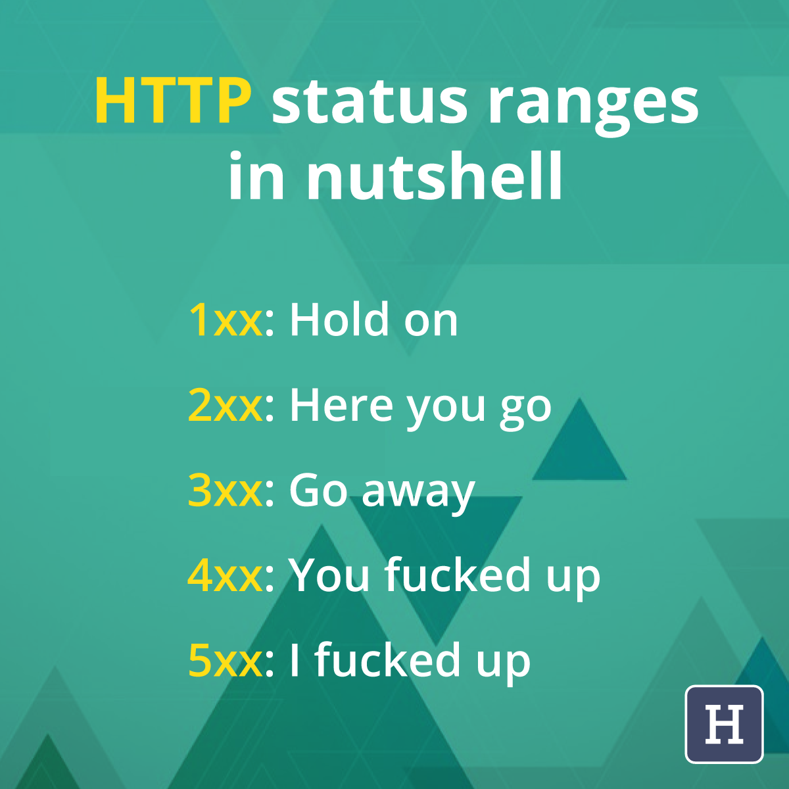

# Spring MVC Web Development
*Building a web application with Spring MVC*

 

## Exercises
* [Recipes](./exercises/recipes) 

 

## Overview
* Spring vs Spring Boot vs Spring MVC:
    * Spring:
        * Is a dependency injection framework for building Java applications
    * Spring MVC:
        * Is a web framework built on the Java Servlet API (part of Spring Framework Core)
            * It is used to create webapps that run on Servlet containers (such as Tomcat)
        * MVC pattern in Spring:

            

    * Spring Boot:
        * An opionated configuration for Spring-based projects
            * It increases developer productivity and enables Spring-based projects to be run as standalone apps (embedded server)
    * Notes:
        * Summary:
            * Spring MVC is the framework that we use to build web apps by leveraging Spring's dispatcher servlet (front controller)
            * Spring Boot can be used in conjunction with Spring MVC to streamline the development process
        * Good [video](https://www.youtube.com/watch?v=e6Ps8I3X-g4)

 

## Thymeleaf
* Thymeleaf is a Java templating engine:
    * It takes a template and converts it to HTML
    * It is not a Web Framework in of itself
    * It is a replacement for JSP's (Java Server Pages), which comes from J2EE (Java Enterprise Edition)
* Thymeleaf is a natural template engine:
    * This means that it can be rendered in the browser (without a Tomcat server, for example)
        * This contrasts JSP's which cannot be viewed properly in the browser alone

 

## HTTP (Hyper Text Transfer Protocol) 
* HTTP Request methods (verbs):
    * `GET`: ask the server for a resource
    * `HEAD`: akin to GET, but only requests the meta-information (without the response body)
    * `POST`: create a new resource on the server
    * `PUT`: update an existing resource on the server or create a new one if it doesn't exist
    * `DELETE`: destroy a resource on the server
    * `TRACE`: echo what was sent to the server (can be used to see if the request was altered by intermediate servers)
    * `OPTIONS`: request the valid HTTP methods that are supported by the endpoint
    * `CONNECT`: create a TCP tunnel (typically used to connect to a HTTPS endpoint through an unencrypted HTTP proxy)
    * `PATCH`: apply partial modifications to a specified resource
* Safe Methods:
    * The following methods are considered 'safe' because they don't cause changes on the server:
        * `GET`
        * `HEAD`
        * `OPTIONS`
        * `TRACE`
* Idempotency:
    * Where the number of times a request is executed is independent from the outcome
        * That is, whether you call an endpoint once or a hundred times, the result will be the same
    * Idempotent methods include:
        * `PUT`
        * `DELETE`
        * Safe Methods
    * When speaking about the typical big four CRUD verbs (`GET`, `POST`, `PUT`, `DELETE`), all are considered idempotent bar `POST`
    * Note, true idempotency is not enforced by the protocol:
        * In essense, it is standard best-practise but a developer could choose to ignore this (at their peril)

     

    

     
     

* HTTP Status Codes:
    * `100` :: Informational
    * `200` :: Successful
    * `300` :: Redirect
    * `400` :: Client-side Error
    * `500` :: Server-side Error

     

    

     

 

## Spring Boot Developer Tools
* The standard web browsers (Chrome, Safari, Firefox) offer a suite of developer tools:
    * The developer tools provide a range of useful information about the code running in the browser
        * The information includes:
            * HTML structure and CSS styling of the page; plus the ability to test updates on the fly (empheral changes)
            * JavaScript source files; plus the ability to set breakpoints
            * Requests sent across the network
            * Local storage
            * JavaScript logs in the console