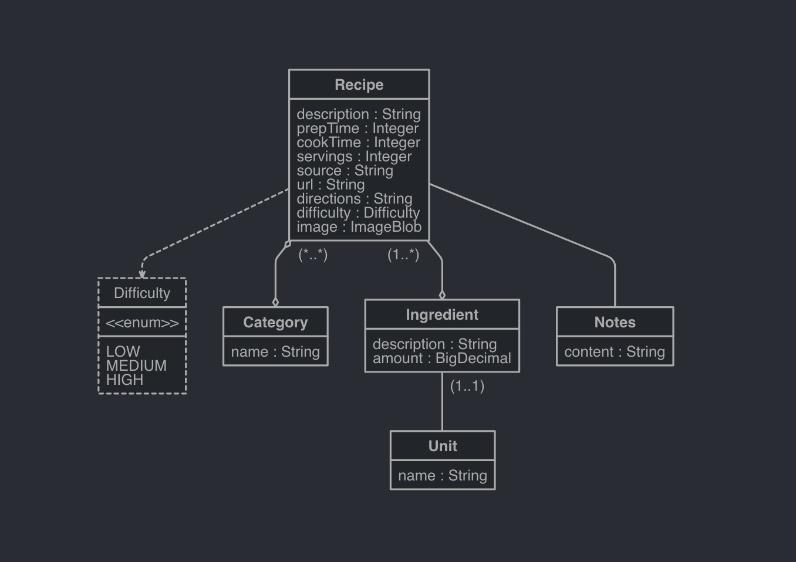

# JPA Data Modelling
*Modelling Java objects as database entities*

 

## Exercises
* [Recipes [Section 7]](../07-spring-mvc-web-dev/exercises/recipes)

 

## JPA Entity Relationships
* Types:
    * `@OneToOne`:
        * A single entity is related to another single entity
    * `@OneToMany`:
        * A single entity is related to multiple other entities
            * Example: Lists, Maps, Sets
    * `@ManyToOne`:
        * The inverse of a 'One to Many' entity relationship
    * `@ManyToMany`:
        * Multiple entities are related to multiple other entities
            * Example: Products and categories
                * Where products can belong to multiple categories and categories can have multiple products
        * A 'Join Table' is used to define the relationships between entities
* Direction:
    * Unidirectional:
        * The mapping is only done in a single direction
        * Only one side of mapping is aware of the relationship
    * Bidirectional:
        * The mapping is done is two directions
        * Both sides are aware of the relationship
        * Hibernate recommends bidirectional mapping:
            * Since it allows you to navigate the object graph in either direction
* Owning Side:
    * One side of the relationship can be considered to 'own' the other side
        * The owning side will hold the foreign keys to the side that is owned
            * In a one-to-one mapping, the owning side is the entity that specifies the foreign keys
            * In a one-to-many or many-to-one mapping, the 'many' side of the relationship is the owning side
    * `mappedBy` is an attribute that allows us to establish bidirectional relationships, whilst only having a foreign key on one side
        * Example: `@OneToMany(mappedBy = "employee") private List<Email> emails;`
            * Here, we have established a bidirectional association between the Employee and Email entities
        * `mappedBy` signals to Hibernate that the key for the relationship is on the other side of the mapping
            * Therefore allowing you to still link from the table not containing the constraint to the table that does
        * The value of `mappedBy` is the name of the association-mapping attribute on the owning side
        * Further reading:
            * Good [article](https://www.baeldung.com/jpa-joincolumn-vs-mappedby)
            * Good Stack Overflow [post](https://stackoverflow.com/questions/9108224/can-someone-explain-mappedby-in-jpa-and-hibernate)
* Fetch Type:
    * Another attribute of the ORM annotations that specifies when we want the data to be fetched
        * Example: `@OneToMany(fetch = FetchType.LAZY)`
    * Types:
        * `FetchType.LAZY`:
            * Data is not queried until it is referenced
        * `FetchType.EAGER`:
            * Data is queried up front
    * JPA 2.1 Fetch Type Defaults:
        * `@OneToOne`: Eager
        * `@OneToMany`: Lazy
        * `@ManyToOne`: Eager
        * `@ManyToMany`: Lazy
* JPA Cascade Types:
    * Cascade Types control how state changes are cascaded down from parent to child objects
        * This encompasses decisions such as: if you delete a parent object, will the child also be deleted?
    * By default, no operations are cascaded
    * Types:
        * `PERSIST`:
            * Save operations will cascade to related entities
        * `MERGE`:
            * Related entities are merged when the owning entity is merged
        * `REFRESH`:
            * Related entities are refreshed when the owning entity is refresh
        * `REMOVE`:
            * Removes all related entities when the owning entity is deleted
        * `DETACH`:
            * Detaches all related entities if a manual detach occurs
        * `ALL`:
            * Applies all of the above cascade options
* Embeddable Types:
    * A POJO that defines a common set of properties, which can be reused across entities
    * Example:
        * An Order might have a shipping address; which we could use as an Embeddable Type
    * Good [article](https://www.baeldung.com/jpa-embedded-embeddable) for further reading
* Hibernate Inheritance:
    * `MappedSuperclass`:
        * Entities inherit from a super class
        * A database table is not created for the super class
    * Single Table:
        * The Hibernate default
        * One table is used for all sub-classes
    * Joined Table:
        * Base class and sub-classes have their own tables
        * Fetching sub-class entities requires a join to the parent table
    * Table-Per-Class:
        * Each sub-class has its own table
* Create & Update Timestamps:
    * It is considered good practise to use create and update timestamps on your entities, for audit purposes
    * JPA supports `@PrePersist` & `@PreUpdate`, which are used to support audit timestamps via JPA lifecycle callbacks
    * Hibernate provides `@CreationTimestamp` and `@UpdateTimestamp`

 

## Data Modelling:
* JHipster Studio is a very useful tool for defining your data model
    * https://start.jhipster.tech/jdl-studio/
* Recipes example:
    * [JDL example](./res/recipes-jdl-data-model.jdl)
    
 

 
