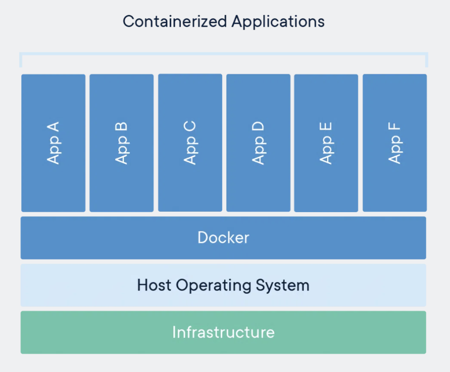
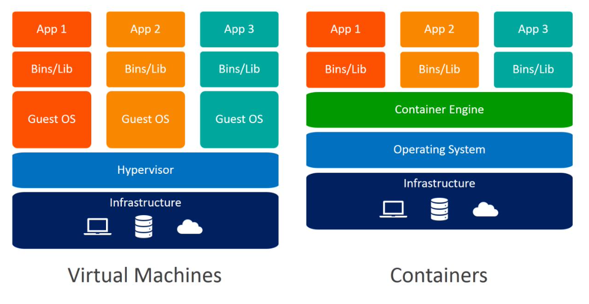

# Introduction to Docker
*The de-facto standard container runtime*

 

## Overview
* What is Docker?
    * Docker is a platform that allows you to manage the life cycle of containers
    * With Docker you can run an application in its own segragated environment, on any OS that supports containerisation
    * Docker was introduced in 2013:
        * Providing a good use for containers, which had been around for some time (but were relatively unused)
        * This ushered in the era of cloud computing:
            * With highly scalable applications based on a microservices architecture - guided by the 12 factors
* What is a Container?
    * Good [article](https://www.veritas.com/en/uk/information-center/containerization)
    * A Container is an isolated runtime, inside of a host machine (be it physical or virtual)
        * It incorporates the runtime and resources necessary for the software unit running inside of it
        * The containerised software comes in the form on an image:
            * An image is a snapshot of a live container, which is used by the Docker Engine to create the container at runtime
                * In this sense, the image is a blueprint for a container - akin to the relationship between an OOP object (container) and its class (image)
    * Benefits of Containerisation:
        * Portability:
            * Containers run consistently and uniformly across any platform or cloud
                * This avoids the problem of 'it works on my machine'
        * Speed & Efficiency:
            * Containers have a fast start-up time, as there is no OS to boot; this increases server efficiency and reduces costs
        * Scalability:
            * Service-oriented app design allows for containers workloads to be scaled horizontally, to match varying increases in demand

     

    

     
     

    * Comparison with Virtual Machines (VM):
        * A Virtual Machine, the predessor of Containers, is a segegrated virtual environment that is created on physical hardware and behaves as its own distinct computer system
            * A software layer, called the Hypervisor, separates the VM's resources from the hardware, so that it gets its own dedicated CPU, memory, network interface and storage
            * Each VM has its own 'guest' operating-system (OS), abstracted from the OS of the host machine
                * With tools like Virtual Box, we can create VM's to run a Windows OS on a Mac; by provising some of our Mac hardware to run as a separate virtual computer
        * Containers differ from VM's in that they do not contain their own OS, and do away with the Hypervisor layer
            * Instead they use the OS of the host machine but abstract the containerised software from this

     

    

* What is Kubernetes?
    * Kubernetes (K8s) is a container orchestration platform that manages container runtime systems across a cluster of networked resources
    * K8s supports the lifecycle management of numerous container runtimes, with Docker as just one example of this
        * 'CRI-O' and 'containerd' are other container runtime examples
    * K8s is not a complete Platform-as-a-Service (PaaS), as there are lots of complexities still to manage for running enterprise apps:
        * Vendor-managed services, such as GKE, AKS, EKS and OCP, bolster Kubernetes to PaaS-status
    * Excellent [article](https://www.atlassian.com/microservices/microservices-architecture/kubernetes-vs-docker) by Atlassian