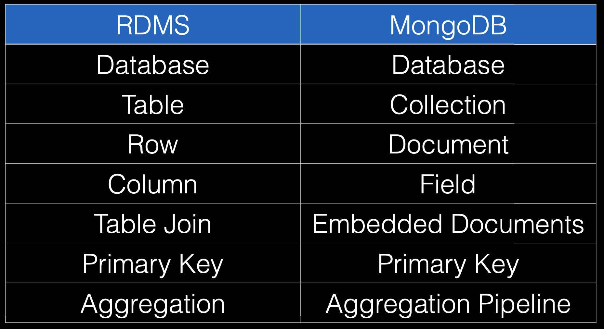

# Spring Data MongoDB
*Exploring MongoDB for later use in reactive programming*

 

## Exercises
* [Recipes :: Mongo](./exercises/recipes-mongo)
    * Note: I have cloned the repo from SFG; to preserve the MySQL example in [recipes](../07-spring-mvc-web-dev/exercises/recipes) and for brevity (avoid a massive re-type of 'recipes' for mongo)
        * I've started with the 'barebones' `master` version and where possible will add my own extensions and refactor for cleanliness

 

## Overview
* [Introduction to MongoDB](./res/IntroductionToMongoDB.pdf)
* MongoDB is a document-oriented database, whose name derives from the word 'Humongous'
* MongoDB is NoSQL:
    * This means that data is stored in documents, rather than tables (as you have with relational databases)
* Mongo use cases:
    * Typically used when you have high insert systems - such as sensor readings, social media and advertising
    * It offers schema flexibility and supports a high number of reads per second
* Mongo downsides:
    * No A.C.I.D compliance
        * A.C.I.D :: Atomicity, Consistency, Isolation, and Durability
    * Industry jokes about lost data
    * No concepts of transactions and not good for concurrent updates
        * This is the trade off for the speed that Mongo offers

 

## Mongo Terminology
