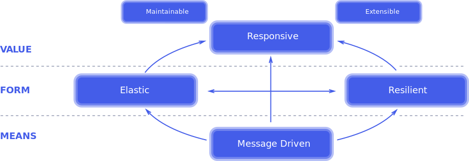

# Introduction to Reactive Programming
*Programming with asynchronous data streams*

 

## Overview
* The Reactive Manifesto:
    * Established in 2013, https://www.reactivemanifesto.org/

     
     

    

     
     

    * Principles of Reactive Systems (Architectural-level):
        * Responsive:
            * Systems should respond in a rapid and consistent manner
            * Timely response is the cornerstone of usability, building or shattering end-user confidence
            * Responsiveness also dictates that system problems be detected quickly and dealt with effectively
        * Resilient:
            * The system is resilient if it remains responsive even in the event of component failures
                * i.e failures in one component are contained and do not bring down the entire system
            * Resilience is achieved via replication, containment, isolation and delegation
        * Elastic:
            * System responsiveness is maintained under varying workloads
            * Reactive Systems can scale resource utilisation up or down to meet demands
        * Message-Driven: ('the most important for Java Developers')
            * Reactive Systems rely of asynchronous messaging to establish a boundary between components
                * Therefore system components are loosely-coupled
                    * This is the foundation on which resiliency and scalability are built upon
            * Non-blocking communication allows recipients to only consume resources whilst active
                * Thus leading to lower system overhead
    * Principles of Reactive Programming (Microservice-level):
        * Reactive Programming focuses on non-blocking asynchronous execution