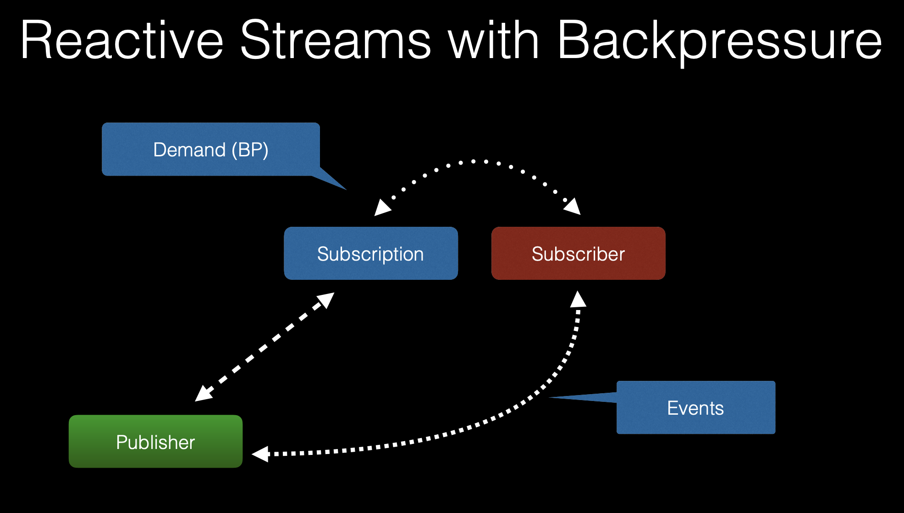

# Introduction to Reactive Programming
*Programming with asynchronous data streams*

 

## Overview
* The Reactive Manifesto:
    * Established in 2013, https://www.reactivemanifesto.org/

     
     

    

     
     

    * Principles of Reactive Systems (Architectural-level):
        * Responsive:
            * Systems should respond in a rapid and consistent manner
            * Timely response is the cornerstone of usability, building or shattering end-user confidence
            * Responsiveness also dictates that system problems be detected quickly and dealt with effectively
        * Resilient:
            * The system is resilient if it remains responsive even in the event of component failures
                * i.e failures in one component are contained and do not bring down the entire system
            * Resilience is achieved via replication, containment, isolation and delegation
        * Elastic:
            * System responsiveness is maintained under varying workloads
            * Reactive Systems can scale resource utilisation up or down to meet demands
        * Message-Driven: ('the most important for Java Developers')
            * Reactive Systems rely of asynchronous messaging to establish a boundary between components
                * Therefore system components are loosely-coupled
                    * This is the foundation on which resiliency and scalability are built upon
            * Non-blocking communication allows recipients to only consume resources whilst active
                * Thus leading to lower system overhead
    * Principles of Reactive Programming (Microservice-level):
        * Reactive Programming focuses on non-blocking asynchronous execution
            * In other words, it is an asynchronous programming paradigm focused on streams of data
        * Reactive Programs maintain continuous interaction with their environment
            * At a speed which is determined by the environment, rather than the program itself
        * Reactive Programs contrast Interactive Programs, which work at their own pace, dealing mainly with communication
            * Instead, Reactive Programs work only in response to external demands from the environment

 

## Reactive Programming
* Features:
    * Data Streams:
        * A 'Stream' is a sequence of events, ordered in time
        * An 'Event' is data that we want to receive for processing
        * Here the 'Data' can be just about anyhing
            * ex: Mouse slicks, JMS messages, REST calls, Stock trades, Twitter feed, list of rows from a database, etc
    * Asynchronous:
        * Events are captured asynchronously:
            * That is, the sender does not wait for the recipient to reply; unlike synchronous comms, where futher communication is dependent on a response
        * Separate functions are defined for handling when events, errors or completion are each emitted
    * Non-blocking:
        * Typical 'blocking' code will stop and wait for more data (i.e reading from a disk, network, etc)
        * In constrast, 'non-blocking' code will process the available data, ask to be notified when more is available and the continue
    * Back-pressure:
        * Backpressure in software systems is the capability to overload the traffic communication:
            * In other words, emitters of information can overwhelm consumers with data they are not able to process
        * The term also applies to the mechanism of handling this:
            * It is the protective actions taken by systems to control downstream forces
        * Good articles:
            * [Medium](https://medium.com/@jayphelps/backpressure-explained-the-flow-of-data-through-software-2350b3e77ce7)
            * [Baeldung](https://www.baeldung.com/spring-webflux-backpressure#:~:text=Backpressure%20in%20Reactive%20Streams,receive%20and%20process%20the%20events.)
    * Failures-as-messages / Failures-as-first-class-citizens:
        * Exceptions are not thrown in the traditional sense, as this would disrupt the processing of the data stream
            * Instead, exceptions are processed gracefully by a handler function
* Notes:
    * Traditional CRUD application are still alive and kicking in the industry
        * Reactive Programming is to be used for certain cases; where there is a heavy focus on processing streams of data

 

## Reactive Streams
* The goal of the Reactive Streams API is to define a standard for async stream procressing with non-blocking back pressure
* Created in 2013, Reactive Streams is a set of 4 interfaces which define the API:
    * `Publisher`
    * `Subscriber`
    * `Subscription`
    * `Processor<T, R> extends Subscriber<T>, Publisher<R>`

 

 

* Spring Reactive Types:
    * Types introduced in Spring 5:
        * Mono:
            * A publisher with zero or one elements in the data stream
        * Flux:
            * A publisher with zero or more elements in the data stream
    * Note:
        * Both types implement the Reactive Streams `Publisher` interface