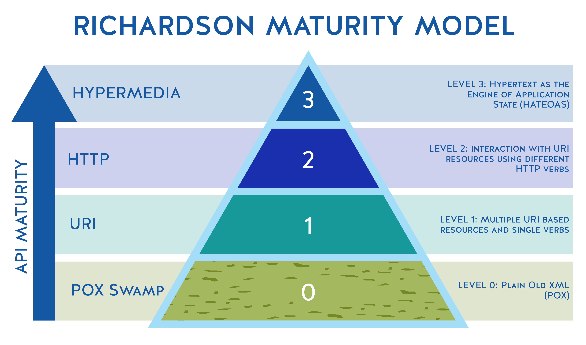

# Introduction to RESTful Web Services
*Communication conforming to the constraints of REpresentational State Transfer*

 

## Exercises
* [spring-rest-client-examples](./spring-rest-client-examples) `@SfgClone(branch="~final")` `@Modified`

 

## Overview
* Due to its simplicity and versatility, RESTful has become that standard for inter-service web communication
* Software communication is RESTful is adheres to the constraints of REST (REpresentational State Transfer)
    * These were establish in 2000 by Roy Fielding; previously SOAP (Simple Object Access Protocol) was the de-facto standard
    * The 'Representational' part of REST is typically JSON, or XML
    * The 'State Transfer' part is typically via HTTP
* RESTful Terminology:
    * Verbs - HTTP Methods:
        * Create Read Update Delete (C: `POST`, R: `GET`, U: `PUT`, D: `DELETE`) and beyond
    * Messages - the payload of the action:
        * JSON / XML format
    * URI - Uniform Resource Indentifier:
        * A unique string that indentifies a resource; e.g 
    * URL - Uniform Resource Locator:
        * A URI with network information; e.g http://www.example.com
    * Idempotence:
        * A property of certain mathematical/compsci operations, where the number of invocations is independent from the result
            * In other words, an operation can be applied multiple times without changing the result beyond the initial application
        * An example of idempotence is refreshing a webpage (HTTP GET operation); whereas POST is non-idempotent
    * Stateless - RESTful services do not maintain client state
    * HATEOAS - Hypermedia As The Engine Of Application State:
        * Under HATEOAS, a client interacts with a network application whose application servers provide information dynamically through hypermedia; a REST client needs little to no prior knowledge about how to interact with an application or server beyond a generic understanding of hypermedia (courtesy of Wikipedia)
        * The restrictions imposed by HATEOAS decouple client and server; enabling server functionality to evolve independently

 

## HTTP Verbs
* `GET`
    * Used to read data from a resource
    * Read-only; safe operation - does not change the state of a resource
    * Idempotent
* `POST`
    * Used to insert a new record (create an object)
    * Not a safe operation; state of a resource is changed
    * Non-Idempotent
* `PUT`
    * Used to insert a record if one doesn't exist for the given id, or will update if it does exist
    * Not a safe operation; state of a resource is changed
    * Idempotent
* `DELETE`
    * Used to remove a record (delete an object)
    * Not a safe operationl state of a resource is changed
    * Idempotent

 

## Richardson Maturity Model
* According to Martin Fowler, The Richardson Maturity Model is 'steps towards the glory of REST'
* The Richardson Maturity Model (RMM) was established in 2008 and is used to describe the quality of so-called RESTful web services
    * This is important because unlike with SOAP, there is no formal specification for RESTful
* RMM Levels Summary:
    * Level 1 - Breaks a large service into distinct URIs
    * Level 2 - Introduces verbs to implement actions
    * Level 3 - Provides discoverability, making the API more self-documenting

 

 

## Spring
* By default, Spring uses Jackson under the covers to bind JSON to Java POJOs