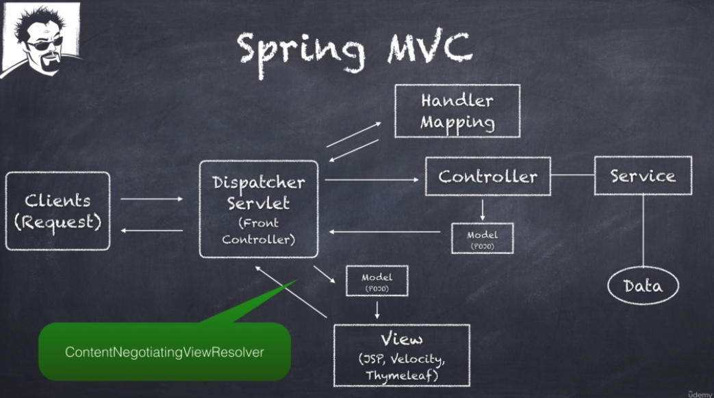

# Spring MVC Content Negotiation
*Allowing client requests to decide on the data format of APIs*

 

## Exercises
* [spring5-mvc-rest-content-neg](./exercises/spring5-mvc-rest-content-neg) `@SfgClone(branch="~final")` `@Modified`

 

## Overview
* Content Negotiation is the ability for a client request to determine which data format is returned by an API:
    * Typically `json` / `html` / `xml` but could also be `pdf` / `csv` / etc

 

 

* The `ContentNegotiatingViewResolver` is a bean in the Spring Context that is responsible for determining which view handler is used:
    * For example, when using Thymeleaf, our `DispatcherServlet` will return `html`
* When using Spring Boot, a `ContentNegotiatingViewResolver` is auto-configured for us:
    * Note: in the absence of Spring Boot, you would be responsible for its configuration
* Accept:
    * The `Accept` HTTP Header is used to specify which data format you want in a response body:
        * e.g `application/json`, `application/xml`, `text/html`
    * By convention: if a requested format is not found, a `406 Not Acceptable` HTTP Status code is returned
    * Beware confusing the `Accept` header with `Content-Type`:
        * `Content-Type` is used by the server to determine the format of a request body