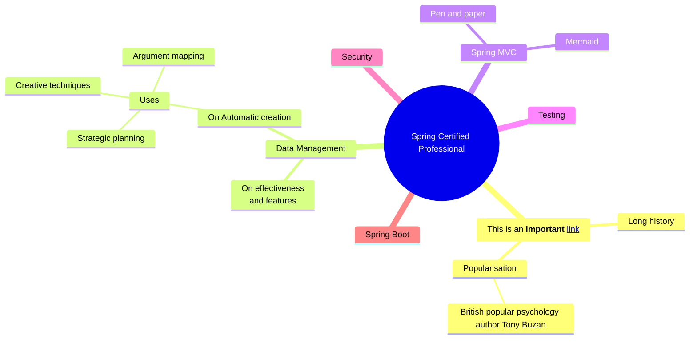

# Spring Certified Professional

 

## Certification Topics

```mermaid
mindmap
  root((Spring Certified Professional))
    A[This is an <b>important</b> <a href='https://google.com'>link</a>]
      Long history
      ::icon(fa fa-book)
      Popularisation
        British popular psychology author Tony Buzan
    Data Management
      On effectiveness<br/>and features
      On Automatic creation
        Uses
            Creative techniques
            Strategic planning
            Argument mapping
    Spring MVC
      Pen and paper
      Mermaid
    Testing
    Security
    Spring Boot
```