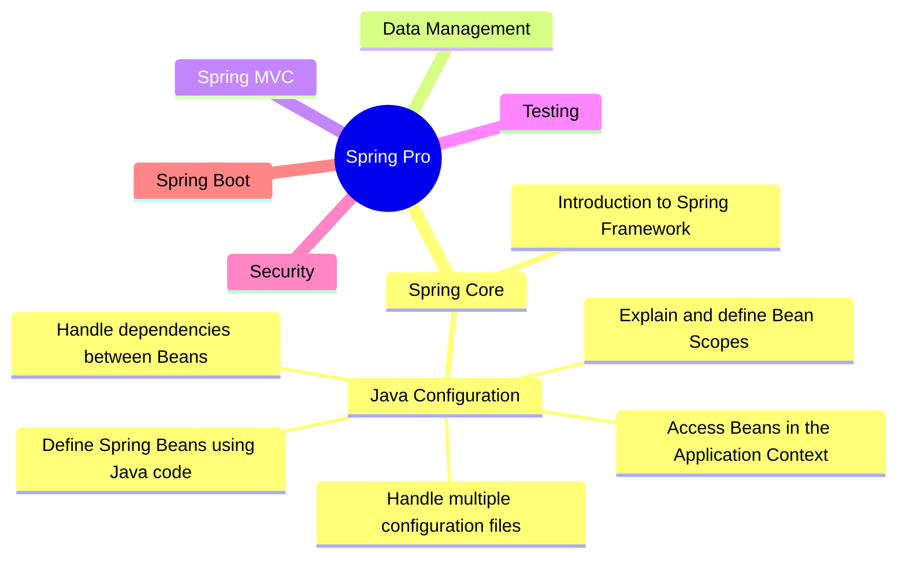

# Spring Certified Professional

 

## Certification Topics

```mermaid
mindmap
  root((Spring Pro))
    Spring Core
      Introduction to Spring Framework
      Java Configuration
        Define Spring Beans using Java code
        Access Beans in the Application Context
        Handle multiple configuration files
        Handle dependencies between Beans
        Explain and define Bean Scopes
    Data Management
    Spring MVC
    Testing
    Security
    Spring Boot
```

 

```mermaid
graph LR;
    A-->B;
    click A "../01-spring-core"
```