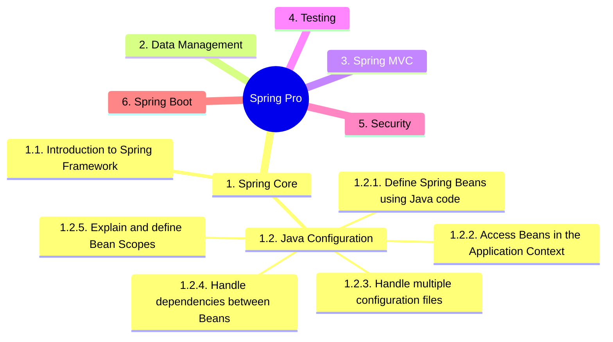

<!-- Badge for the date and score, with official link? -->

# Spring Certified Professional

 
 
 
 

 
 

## Topics
* [1. Spring Core](../01-spring-core)
    * [1.1. Introduction to Spring Framework]()
    * [1.2. Java Configuration]()
        * [1.2.1. Define Spring Beans using Java code]()
* [2. Data Management](../02-data-management)