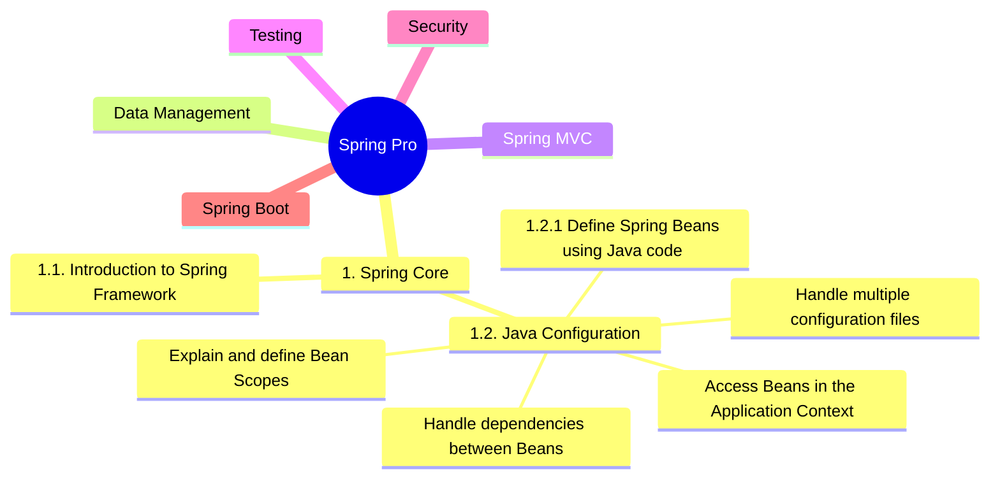

# Spring Certified Professional

 
 

<!-- Try to get links working on the mindmap -->

 

### [1. Spring Core](../01-spring-core)
* [1.1. Introduction to Spring Framework]()
* [1.2. Java Configuration]()
  * [1.2.1. Define Spring Beans using Java code]()

### [2. Data Management](../02-data-management)